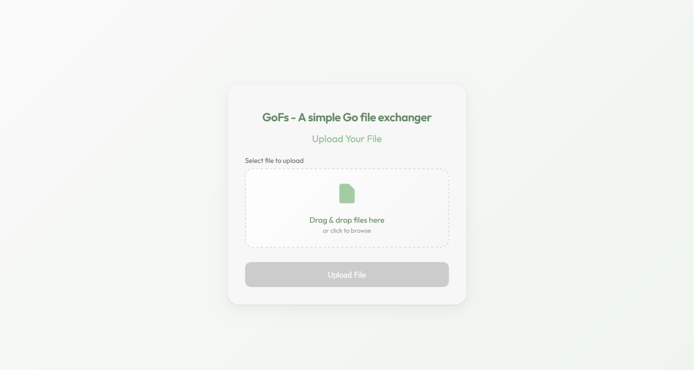
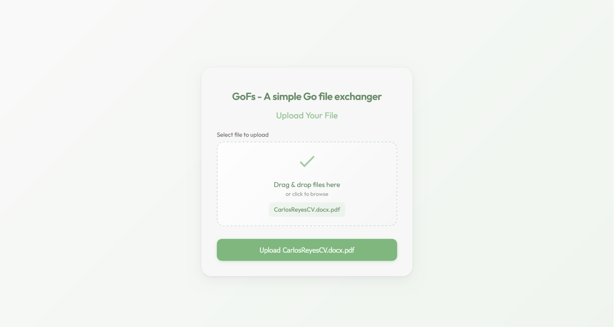
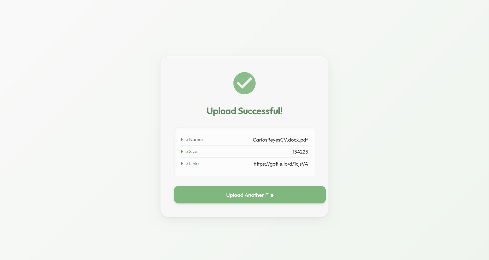

# Go File Upload Service

A simple Golang-based web application for uploading and viewing file information. This project allows users to upload files via a drag-and-drop interface and displays details about the uploaded file, so they can share a download link with their friends. The application is deployed on Render and uses embedded HTML templates for rendering views.

## Features
- **File Upload**: Upload a file file using a user-friendly drag-and-drop interface.
- **File Information Display**: View details of the uploaded file, such as name, size and download link.
- **Responsive Design**: Clean and modern UI built with HTML and TailwindCSS.
- **Golang Backend**: Lightweight server using the standard `net/http` package.
- **Embedded Templates**: HTML templates embedded using Go's `embed` package.

## Tech Stack
- **Backend**: Golang (`net/http`, `embed`)
- **Frontend**: HTML, CSS
- **Deployment**: Render (https://gofs.onrender.com/upload)

## Usage

### Step 1: Access the Upload Page
Navigate to `https://gofs.onrender.com` to access the main upload page.

### Step 2: Upload a File
Drag and drop a file into the designated area or click to browse. Once a file is selected, the upload button becomes active.

### Step 3: View File Information
After uploading, you will be redirected to a page displaying the file's details, such as its name, size, and download link.

## License
This project is licensed under the MIT License. See the [LICENSE](LICENSE) file for details.

## Acknowledgments
- Built with [Golang](https://golang.org/) and its standard library.
- Hosted on [Render](https://render.com/).
- Inspired by [Ranoz](https://ranoz.gg/).
